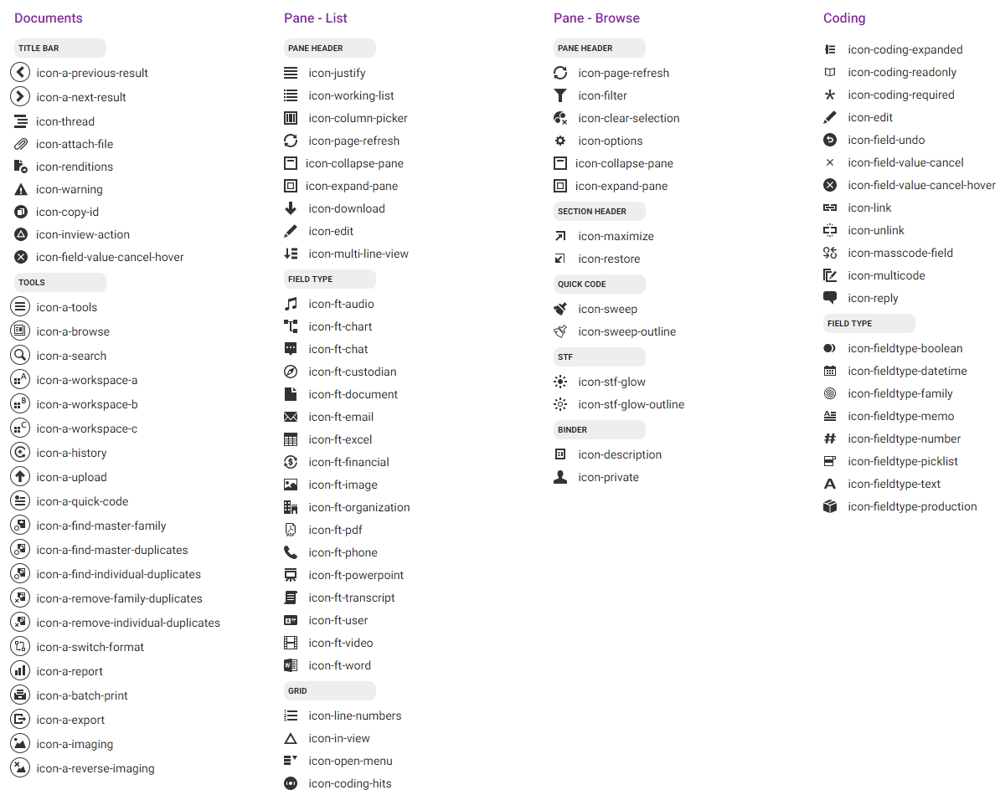

# Discover UIX API
The Discover UI Extension SDK is available from the `Ringtail` namespace on the global `window` object.

**Conventions:** Nested namespaces are PascalCase and API methods are camelCase.

- [Discover](#ringtail-uix-api)
  - [.initialize(domainWhitelist)](#initializedomainwhitelist--promise)
  - [.on(eventName, callback)](#oneventname-callback)
  - [.off(eventName, callback)](#offeventname-callback)
  - [.setLoading(loading)](#setloadingloading--promise)
  - [.showNotification(status, message)](#shownotificationstatus-message--promise)
  - [.setTools(tools)](#settoolstools--promise)
  - [.query(graphQl[, variables])](#querygraphql-variables--promise)
  - [.Context](#context)
  - [.ActiveDocument](#activedocument)
    - [.get()](#get--activedocument)
    - [.set(mainId)](#setmainid--promise)
  - [.DocumentSelection](#documentselection)
    - [.get()](#get--promise)
    - [.set(mainIds)](#setmainids--promise)
    - [.select(add, mainIds)](#selectadd-mainids--promise)
    - [.selectAll()](#selectall--promise)
  - [.BrowseSelection](#browseselection)
    - [.get(fieldId)](#getfieldid--promise)
    - [.set(fieldId, values)](#setfieldid-values--promise)
    - [.select(fieldId, add, values)](#selectfieldid-add-values--promise)
  - [.ToolWindow](#toolwindow)
    - [.setOkButtonEnabled(enabled)](#setokbuttonenabledenabled--promise)
    - [.close()](#close--promise)
    - [.loadSearchResult(searchResultId)](#loadsearchresultsearchresultid--promise)

- [Events](#events)
  - [ActiveDocument](#activedocument-1)
  - [DocumentSelection](#documentselection-1)
  - [BrowseSelection](#browseselection-1)
  - [PaneHidden](#panehidden)
  - [PaneVisible](#panevisible)
  - [ToolAction](#toolaction)
  - [WorkspaceTools_OkClick](#workspacetools_okclick)
- [Configuration](#configuration)
  - [Recommended Use](#recommended-use)
- [ToolConfig](#toolconfig)
  - [Shared Properties](#shared-properties)
  - [Types](#types)
    - [button](#button)
    - [combo](#combo)
  - [Tool Icons](#tool-icons)

#### .initialize(domainWhitelist) ⇒ <[Promise]>
- `domainWhitelist` <[Array]<[String]>> Optional array of whitelisted domains the UIX will accept messages from. If not provided, messages from any domain will be accepted. You can use this to restrict the domains that can host your UI extension, making it harder for unknown sites to spoof the application.
- returns: A promise that resolves to the domain of the site hosting the UIX. After this, [Ringtail.Context](#context) is available and the SDK is ready for use.

Initializes the SDK and registers the UIX with the application.

#### .on(eventName, callback)
- `eventName` <[String]> Name of the [event](#events) to listen for.
- `callback` <[Function]> Callback function to be called with these parameters:
  - `event` <[Event](#events)> Event object received from the application.

Subscribes the provided `callback` to be called when the given event is received from the application.

#### .off(eventName, callback)
- `eventName` <[String]> Name of the [event](#events) originally subscribed to.
- `callback` <[Function]> Callback function originally passed to [.on()](#oneventname-callback).

Removes the provided `callback` subscription to the given event.

#### .setLoading(loading) ⇒ <[Promise]>
- `loading` <[Boolean]> `true` to display the loading mask, `false` to hide it.
- returns: A promise that resolves once the loading mask has been shown or hidden.

Displays or hides a loading mask over the UIX to block user interactions.

#### .showNotification(status, message) ⇒ <[Promise]>
- `status` <[String]> `success` to display the success icon, `warning` to display the warning icon, `error` to display the error icon.
- `message` <[String]> The message to display in the notification toast.
- returns: A promise that resolves once the notification has been shown.

Displays a notification toast to the user with the given status icon and the given message.

#### .setTools(tools) ⇒ <[Promise]>
- `tools` <[Array]<[ToolConfig](#toolconfig)>> Array of tool configurations to display in the application.
- returns: A promise that resolves when the tools have successfully been constructed and populated in the application's UI. Rejects with details if the tool config was malformed.

Allows a UIX to display buttons and other simple UI widgets in the application's toolbars, giving them a native look and feel. To be notified when users interact with these tools, subscribe to the [ToolAction](#toolaction) event.

#### .query(graphQl[, variables]) ⇒ <[Promise]>
- `graphQl` <[String]> [GraphQL]((http://graphql.org/learn/)) query for the application's Connect API.
- `variables` <[Object]> (Optional) Object providing values for variables in the query.
- returns: A promise that resolves to the results of the query.

Executes the given [GraphQL]((http://graphql.org/learn/)) query against the application in the context of the current user. Use the application's Connect API Explorer (available from the Portal) to build and test queries and review documentation.


### .ContextF
Static object containing context information about the current application user. It is available once the SDK is [initialized](#initialize--promise) and has these fields:
- `uixId` <[Number]> ID of this UIX in the application.
- `portalUserId` <[Number]> ID of the current user in this application portal.
- `portalUrl` <[String]> Public URL of this application's instance.
- `userName` <[String]> Current user's username.
- `caseId` <[Number]> ID of the user's current case, or `0` if in the portal.
- `caseName` <[String]> Display name of the current case or `null` if in the portal.
- `caseUuid` <[String]> **9.7.003** Globally unique identifier for this case, such as `B5805A45-8537-47E2-A9EE-A946B70D5EE9`. Use this to associate data in external systems with an application case.
- `orgId` <[Number]> ID of the user's current organization, or `null` if in the portal.
- `orgName` <[String]> Display name of the current organization or `null` if in the portal.
- `apiUrl` <[String]> URL to use to make API server calls, such as `http://discover.example.com/Ringtail-Svc-Portal/api/query`.
- `downloadUrl` <[String]> **9.7.003** URL to use to download document files and images, such as `http://discover.example.com/Ringtail-Svc-Portal/api/download`.
- `apiAuthToken` <[String]> Authentication token to make API calls on behalf of the current user to the application's Connect API. Looks like `Bearer eyJ0eXAiOiJKV1QiLCJhbGciOiJSUzI1NiIsIng1dCI6Ik...`.
- `hostLocation` <[String]> Name of the location in the application where this extension is hosted, allowing UIX web apps to alter their behavior when run from different locations. Will be one of:
  - `Workspace` - Documents area workspace pane
  - `Case` - Case home page
- `ringtailVersion` <[String]> Version of the application the UIX is running in, such as `9.5.000.fe6290c`.
- `configuration` <[Array]<[Configuration](#configuration)>> An array of optional configuration strings provided by the administrator when adding UIXs. The array will be empty if no configs are provided. See [Configuration](#configuration) for more information.
- `externalAuthToken` <[String]> (Optional) JWT wrapping this context information as claims and signed with the UIX's authentication secret. This value will only be provided if an authentication secret was provided during UIX installation. It is intended for use in verifying authenticity of the hosting application for scenarios such as automatic login. See [Authentication with JWTs](AuthWithJWTs.md) for more information.
- `annotationSource` <[Number]> ID to use when annotating documents to indicate they should be printed by the extension for production. See [External File Printing](ExternalFilePrinting.md) for more information.
- `namePrefix` <[String]> (Optional) Statistic and field name prefix configured for this UIX during installation.
- `fields` <[Array]<[Object]>> (Optional) Array of field ID mappings for the active case.
  - `id` <[Number]> ID provided for this field by the [UIX manifest](ExtensionManifest.md) during installation.
  - `name` <[String]> Name provided for this field by the [UIX manifest](ExtensionManifest.md) during installation.
  - `fieldId` <[String]> ID for this field in the active case. Use this identifier when coding this field.
  - `items` <[Array]<[Object]>> Array of field value mappings for `PickList` fields or `null` for other field types.
    - `id` <[Number]> ID provided for this value by the [UIX manifest](ExtensionManifest.md) during installation.
    - `name` <[String]> Name provided for this value by the [UIX manifest](ExtensionManifest.md) during installation.
    - `codingValue` <[Number]> Coding value for this item. Use this value when coding this field.
- `statistics` <[Array]<[Object]>> (Optional) Array of statistic ID mappings for the active case.
  - `id` <[Number]> ID provided for this statistic by the [UIX manifest](ExtensionManifest.md) during installation.
  - `name` <[String]> Name provided for this statistic by the [UIX manifest](ExtensionManifest.md) during installation.
  - `statisticId` <[Number]> ID for this statistic in the active case. Use this identifier to write this statistic.
- `annotations` <[Array]<[Object]>> (Optional) Array of annotation ID mappings for the active case.
  - `id` <[Number]> ID provided for this annotation by the [UIX manifest](ExtensionManifest.md) during installation.
  - `name` <[String]> Name provided for this annotation by the [UIX manifest](ExtensionManifest.md) during installation.
  - `annotationTypeId` <[String]> ID for this annotation in the active case. Use this identifier to add annotations of this type to documents via the Connect API.


### .ActiveDocument
When a [search result] is loaded into a [workspace], the [active document] is the primary document displayed in the View and Conditional Coding panes. Subscribe to the [ActiveDocument](#activedocument-1) event to be notified on change.

#### .get() ⇒ <[ActiveDocument](#activedocument-1)>
- returns: Information about the current active document

If there is no active document (due to no active [search result] for example) fields in the returned object will be `null`.

#### .set(mainId) ⇒ <[Promise]>
- `mainId` <[Main ID]> Main ID of the document to activate.
- returns: A promise that resolves upon the application's acknowledgement of the request.


### .DocumentSelection
Document selection in the application is tied to a [search result]. This means that documents cannot be selected if there is no active [search result], and they cannot be selected UNLESS they are present in the active [search result]. Subscribe to the [DocumentSelection](#documentselection-1) event to be notified on change.

#### .get() ⇒ <[Promise]>
- returns: A promise resolving to an object with these properties:
  - `mainIds` <[Array]<[Main ID]>> Array of numerical main IDs.

This request may take a long time to complete depending on the size of the active [search result] and the number of selected documents. It is advisable to request the full document selection only sparingly.

#### .set(mainIds) ⇒ <[Promise]>
- `mainIds` <[Array]<[Main ID]>> Main IDs of the documents to select.
- returns: A promise that resolves upon the application's acknowledgement of the request.

Clears any prior selection and selects the given documents. Pass an empty array to clear the selection.

#### .select(add, mainIds) ⇒ <[Promise]>
- `add` <[Boolean]> `true` to select the given documents, `false` to deselect.
- `mainIds` <[Array]<[Main ID]>> Main IDs of the documents to select or deselect.
- returns: A promise that resolves upon the application's acknowledgement of the request.

Incrementally modifies the current document selection.

#### .selectAll() ⇒ <[Promise]>
- returns: A promise that resolves upon the application's acknowledgement of the request.

Selects all documents in the active [search result].


### .BrowseSelection
[BrowseSelection] is the set of selected field values in the Browse pane. Browse sections are tied to the application fields and are uniquely identified by field IDs. Subscribe to the [BrowseSelection](#browseselection-1) event to be notified on change.

> NOTE: Only pick list fields are supported for BrowseSelection.

#### .get(fieldId) ⇒ <[Promise]>
- `fieldId` <[String]> ID of the field for which to retrieve its selection.
- returns: A promise that resolves to an object with these properties:
  - `values` <[Array]<[Number]>> Array of the IDs of selected values.

#### .set(fieldId, values) ⇒ <[Promise]>
- `fieldId` <[String]> ID of the field for which to replace the selection.
- `values` <[Array]<[Number]>> Array of IDs of the values to select.
- returns: A promise that resolves upon the application's acknowledgement of the request.

Clears any prior selection and selects the provided values for the given Browse section. Pass an empty array to clear the selection for a Browse section.

#### .select(fieldId, add, values) ⇒ <[Promise]>
- `fieldId` <[String]> ID of the field for which to alter the selection.
- `add` <[Boolean]> `true` to select the given field values, `false` to deselect.
- `values` <[Array]<[Number]>> Array of IDs of the values to select or deselect.
- returns: A promise that resolves upon the application's acknowledgement of the request.

Incrementally modifies the current BrowseSelection.

### .ToolWindow
The Tool window is available for the [Workspace] tools UI Extensions (UIX).  It can be used to interact with the hosting window or to change the [search result].

#### .setOkButtonEnabled(enabled) => <[Promise]>
- `enabled` <[Boolean]> `true` to enable the OK button, `false` to disable
- returns: A promise that resolves when the OK button has been enabled or disabled

Enables or disables the OK button in the [Workspace] tools UIX window

#### .close() => <[Promise]>
- returns: A promise that resolves when the Workspace tools UIX window has been closed.

Closes the [Workspace] tools UIX window

#### .loadSearchResult(searchResultId) => <[Promise]>
- `searchResultId` ID of the [search result] to load in the [Workspace]
- returns: A promise that resolves after the [search result] has been loaded

Loads the [Workspace] with the [search result] for the given searchResultId


# Events
Events sent from the application's UI have this structure:
```js
{
    "name": "ActiveDocument", // Required, always present
    "data": {                 // Optional, null if unused
        "mainId": 289346,
        "documentId": "ENRON-0029918",
        "searchResultId": 1903,
        ...
    }
}
```
Event properties are nested in a `data` object.  Use the following fields and object syntax to access them.

```js
var mainid = event.data.mainId;
```

#### ActiveDocument
- `mainId` <[Main ID]> Internal ID of the active document.
- `documentId` <[Document ID]> Displayed ID of the document that is unique in the case.
- `documentTitle` <[String]> Title of the document.
- `documentType` <[Number]> ID of the document's type.
- `documentTypeName` <[String]> Display name of the document's type.
- `searchResultId` <[Number]> ID of the active [search result].
- `entityId` <[Number]> ID of the active document's entity type.

This event is sent from the application whenever the [active document](Glossary.md#active-document) changes. If there is no active document (due to an empty [search result] for example) these fields will be `null`.

#### DocumentSelection
- `selectedCount` <[Number]> Total number of selected documents.

This event is sent from the application whenever the selected documents change.

#### BrowseSelection
- `fieldId` <[String]> ID of the field who's BrowseSelection has changed.
- `values` <[Array]<[Number]>> All values of the field that are currently selected.

The application sends this event when a [BrowseSelection] changes.

#### PaneHidden
Sent when the UIX is hidden via changing the active workspace, pane collapse, navigating away, etc. No events will be sent to the UIX while it is hidden.

#### PaneVisible
Sent when the UIX becomes visible via changing the active workspace, pane expand, first load, etc. No events will be sent to the UIX until it is shown, and the SDK initialized.

#### ToolAction
- `id` <[String]> ID of the tool the user interacted with, provided by the [ToolConfig](#toolconfig).
- `value` <[String]|[Number]> (Optional) New value of the tool for stateful tools.

ToolAction events are fired when the user interacts with tools constructed by [setTools](#settoolstools-promise).

#### WorkspaceTools_OkClick
This event is sent from the application when a [Workspace] tools UI Extension window's OK button is clicked.


# Configuration
UIX configurations are optional strings that can contain anything the UIX needs to setup or configure itself, such as license keys, INI variables, XML, or JSON. The application stores and provides these upon initialization and mandates no format or schema.

__NOTE:__ If you store sensitive information in configurations, [Authentication with JWTs](AuthWithJWTs.md) is recommended to transmit the configurations securely and trust their authenticity.

## Recommended Use
Configurations can be specified at the UI extension, organization, and case levels separately and they are passed in an array, in that order, with any unset configs skipped. This structure is intended to facilitate increasingly-specific settings overriding broader settings.

For example, given these configurations as JSON strings:
```js
var configsFromRingtail = ['{"a":false}', '{"b":12}', '{"a":true}']; // From the application.Context.configuration
//                            ^ UIX ^      ^ Org ^      ^ Case ^
```

To compose a final configuration state for use, merge them together in order provided:
```js
var result = {};
configsFromRingtail.forEach(function (json) {
    var config = JSON.parse(json);
    Object.keys(config).forEach(function (key) {
        result[key] = config[key];
    });
});

// Equivalent to this, though it doesn't work natively in IE:
result = Object.assign.apply(null, configsFromRingtail.map(JSON.parse));

// Produces: { a: true, b: 12 }
// Note that case-level config { a: true } overrides the UIX-level config of { a: false }
```
This strategy facilitates flexible reuse and sharing of configuration across organizations and cases, allowing scenarios such as overriding a single setting for a specific case but inheriting the rest from the case's parent organization.


# ToolConfig
The application provides the capability for UIXs to construct native UI widgets called `Tools` which are built from plain JSON-object specifications called `ToolConfigs`.

Here are some examples:
```js
{ // Button
    type: 'button',
    icon: 'icon-print',
    id: 'printButton',
    label: 'Print'
}

{ // Combo box
    type: 'combo',
    id: 'graphTypePicker',
    width: 80,
    value: 'bar',
    choices: [
        { id: 'bar', name: 'Bar' },
        { id: 'line', name: 'Line' },
        { id: 'pie', name: 'Pie' },
    ]
}
```

## Shared Properties
All tools share these properties:
- `type` <[String]> Type of tool to construct. See [Types](#types).
- `id` <[String]> ID of this tool, used to identify it in [ToolAction](#toolaction) events when the user interacts with it.

## Types

#### button
- `icon` <[String]> Name of the icon to display for this button. See [Tool Icons](#tool-icons) for the set of supported icons.
- `label` <[String]> Display name of this button, displayed in tooltips and menus.

Simple stateless, clickable button.

#### combo
- `value` <[String]|[Number]> (Optional) Currently-selected value. May be null for no starting value.
- `placeholder` <[String]> (Optional) Placeholder text to display in the combo when there is no value selected.
- `width` <[Number]> (Optional) Width in pixels of the combo box.
- `choices` <[Array]<[Object]>> Choices to pick from in the combo's dropdown. Each choice has these properties:
  - `id` <[String]|[Number]> ID of this choice, used as the value when selecting.
  - `name` <[String]> Display value for this choice in the dropdown.

Filterable combo box with preset choices.

## Tool Icons



[null]: https://developer.mozilla.org/en-US/docs/Web/JavaScript/Reference/Global_Objects/null "null"
[Array]: https://developer.mozilla.org/en-US/docs/Web/JavaScript/Reference/Global_Objects/Array "Array"
[boolean]: https://developer.mozilla.org/en-US/docs/Web/JavaScript/Data_structures#Boolean_type "Boolean"
[function]: https://developer.mozilla.org/en-US/docs/Web/JavaScript/Reference/Global_Objects/Function "Function"
[number]: https://developer.mozilla.org/en-US/docs/Web/JavaScript/Data_structures#Number_type "Number"
[Object]: https://developer.mozilla.org/en-US/docs/Web/JavaScript/Reference/Global_Objects/Object "Object"
[Promise]: https://developer.mozilla.org/en-US/docs/Web/JavaScript/Reference/Global_Objects/Promise "Promise"
[string]: https://developer.mozilla.org/en-US/docs/Web/JavaScript/Data_structures#String_type "String"
[Error]: https://nodejs.org/api/errors.html#errors_class_error "Error"
[Map]: https://developer.mozilla.org/en-US/docs/Web/JavaScript/Reference/Global_Objects/Map "Map"

[Active document]: Glossary.md#active-document "Active docum,ent"
[Document ID]: Glossary.md#document-id "Document ID"
[BrowseSelection]: Glossary.md#browse-selection "BrowseSelection"
[Main ID]: Glossary.md#main-id "Main ID"
[Search result]: Glossary.md#result-set "Search result"
[Workspace]: Glossary.md#workspace "Workspace"
