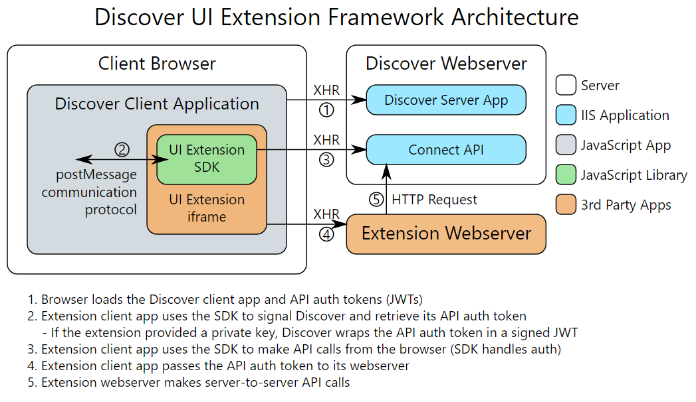

# Discover User Interface Extension SDK
This SDK provides an API to communicate with the Discover UI for use in UI extensions, part of Discover's extensibility model.

## Documentation
- [API Reference](API.md) - JavaScript client SDK documentation
- [Extension Manifest Format](ExtensionManifest.md) - Format to specify UI extension settings for easy installation
- [Authentication with JWTs](AuthWithJWTs.md) - Explains how to authenticate Discover user sessions with external system
- [External File Printing](ExternalFilePrinting.md) - Explains how to extend Discover productions with custom file printing
- [Download Document Files](DownloadFiles.md) - Explains how to download the files associated with documents

## About User Interface Extensions
You can extend Discover by embedding third-party web applications directly into the Discover interface. Such external applications are called user interface extensions (UIX). Discover provides UIXs with user and workspace context and access to the Discover Connect API. This allows UIXs to read and write data to Discover and respond to user actions in the Discover UI.

The following diagram shows how an external web application (orange) can communicate with the Discover UI (gray) via the UI Extension SDK (green). In addition, the UI Extension SDK provides an API to facilitate directly calling the Discover Connect API (blue).



## Install the SDK
The SDK is available as a package on NPM:

`npm install ringtail-extension-sdk`

To support IE11, you also need to provide promise and fetch polyfills, such as:

`npm install promise-polyfill whatwg-fetch`

> NOTE: This library only works in web browsers. For compatibility with the Discover application, UI extensions must support all browsers that Discover supports&mdash;as of December 2018, this includes Internet Explorer 11, Chrome, and Edge. For more information, see the client computer requirements in the *Discover Help*.

## Build Your Extension
To communicate with Discover, initialize the SDK and then hook up listeners for the events that you are interested in. Here's an example that listens for and displays active document changes:

```html
<!DOCTYPE html>
<html>
<head>
    <title>Discover UI Extension Test App</title>
    <script src="node_modules/ringtail-extension-sdk/Ringtail.js" type="text/javascript"></script>
</head>
<body>
    <h2>Active Document</h2>
    <p>
        <table>
            <tr><td>Document ID</td><td class="active-doc-id"></td></tr>
            <tr><td>Main ID</td><td class="active-main-id"></td></tr>
            <tr><td>Entity ID</td><td class="active-entity-type-id"></td></tr>
            <tr><td>Search Result ID</td><td class="active-result-set-id"></td></tr>
        </table>
    </p>

    <script>
        function handleActiveDocumentChanged(message) {
            document.querySelector('.active-doc-id').innerHTML = message.data.documentId || '';
            document.querySelector('.active-main-id').innerHTML = message.data.mainId || '';
            document.querySelector('.active-entity-type-id').innerHTML = message.data.entityId || '';
            document.querySelector('.active-result-set-id').innerHTML = message.data.searchResultId || '';
        }

        // Establish communication with Discover
        Ringtail.initialize().then(function () {
            // Listen for ActiveDocument changes
            Ringtail.on('ActiveDocument', handleActiveDocumentChanged);
        });
    </script>
</body>
</html>
```

## Add Your Extension to Discover
Once you are ready to test and deploy your extension, you need to add it to a Discover environment. Portal and system administrators have access to the UI Extensions area of the Discover portal and can install and configure extensions.

There are three steps to getting a UIX to show up in Discover.

### 1. Add the UI extension in the portal
In the UI Extensions area of the Discover portal you have several options for adding an extension:

  - For simple UI extensions like the one above, you can specify required settings in the Basic section of the Add UI extension dialog box.
  - For more complex UI extensions using custom fields and statistics counters, you need to specify settings via an [extension manifest](ExtensionManifest.md). Once ready, you can import the manifest into the Advanced section of the Add UI extension dialog box.

### 2. Assign the UI Extension to Organizations and Cases
After the extension is added, click on it in the UI extension list to assign it to one or more Organizations and Cases. This step grants access to the extension for users in the allowed cases and causes Discover to automatically create any fields and statistics counters that are specified in the extension manifest.

### 3. In each Discover case, grant access to the extension for one or more user groups
UI extensions assigned to cases show up in the Features page of the Security area for case administrators. Allow access to the extension for your current user group and refresh your browser to see the UIX in Discover.

# License

```
Copyright 2021 Nuix

Licensed under the Apache License, Version 2.0 (the "License");
you may not use this file except in compliance with the License.
You may obtain a copy of the License at

   http://www.apache.org/licenses/LICENSE-2.0

Unless required by applicable law or agreed to in writing, software
distributed under the License is distributed on an "AS IS" BASIS,
WITHOUT WARRANTIES OR CONDITIONS OF ANY KIND, either express or implied.
See the License for the specific language governing permissions and
limitations under the License.
```